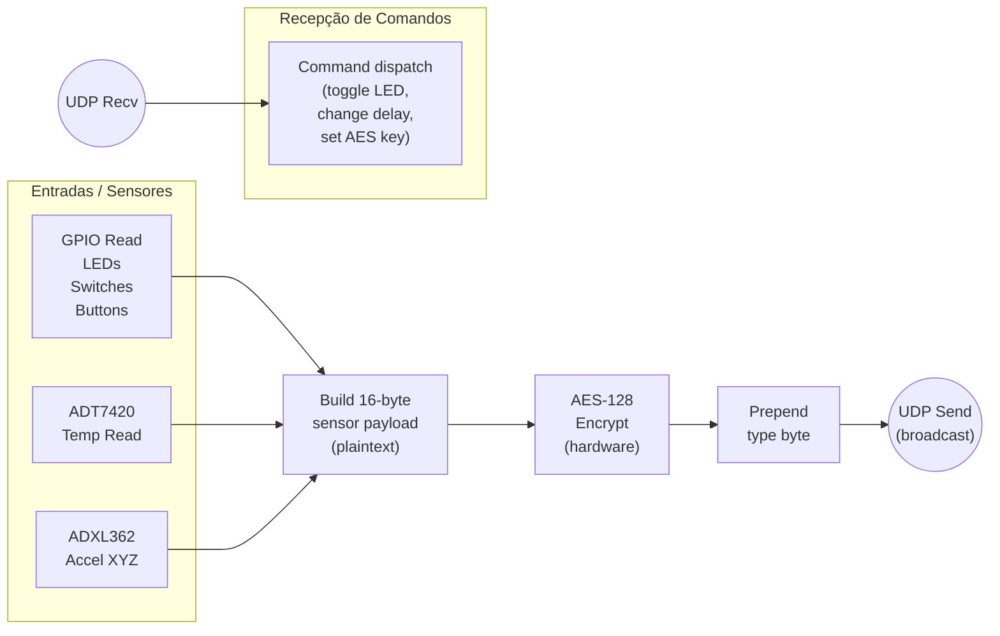
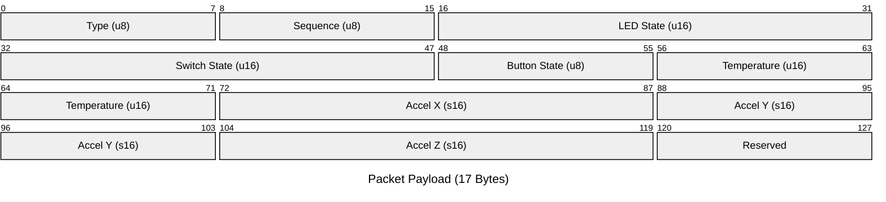

# IoT Gateway Application

Bare-metal RISC-V application for a Xilinx FPGA IoT gateway. Periodically reads
board I/O state (LEDs, switches, push buttons) and temperature from ADT7420 and ADXL362 
sensors, encrypts the data with a hardware AES-128 accelerator, and transmits
the ciphertext over raw UDP/Ethernet. Also listens for simple ASCII commands
to toggle LEDs, change the TX interval, and set the AES key.

## Hardware

| Peripheral          | Description                              |
|-------------------- |------------------------------------------|
| AXI Ethernet FIFO   | Ethernet TX/RX FIFO                      |
| AXI Ethernet        | Ethernet MAC                             |
| AXI GPIO (Buttons)  | 5 push buttons (input)                   |
| AXI GPIO (LEDs)     | 16 LEDs (output)                         |
| AXI GPIO (Switches) | 16 DIP switches (input)                  |
| AXI IIC             | I2C master for ADT7420                   |
| ADT7420             | Digital temperature sensor (I2C, 13-bit) |
| AXI Quad SPI        | SPI master for ADXL362                   |
| ADXL362             | 3-axis MEMS accelerometer (SPI, 12-bit)  |
| AES-128 Accelerator | Custom AES-128 encryption                |

## Data Flow

## Packet Format (17 bytes)

The packet type byte is sent **in plaintext**. The remaining 16 bytes are AES-128 encrypted. This allows the receiver to identify the packet type without decryption.

type = 0x01 : Sensor data packet

> O type foi deixado aqui para o futuro porque tinha a ideia de adicionar mais tipos de pacotes, por exemplo para informar o delay entre transmissão.

## AES-128 Accelerator Register Map

| Offset | Name   | Access | Description                |
|--------|--------|--------|----------------------------|
| 0x00   | CTRL   | R/W    | Bit 0 = start              |
| 0x04   | STATUS | R      | Bit 0 = done, bit 1 = busy |
| 0x08   | KEY0   | R/W    | key[127:96]                |
| 0x0C   | KEY1   | R/W    | key[95:64]                 |
| 0x10   | KEY2   | R/W    | key[63:32]                 |
| 0x14   | KEY3   | R/W    | key[31:0]                  |
| 0x18   | PT0    | R/W    | plaintext[127:96]          |
| 0x1C   | PT1    | R/W    | plaintext[95:64]           |
| 0x20   | PT2    | R/W    | plaintext[63:32]           |
| 0x24   | PT3    | R/W    | plaintext[31:0]            |
| 0x28   | CT0    | R      | ciphertext[127:96]         |
| 0x2C   | CT1    | R      | ciphertext[95:64]          |
| 0x30   | CT2    | R      | ciphertext[63:32]          |
| 0x34   | CT3    | R      | ciphertext[31:0]           |

Software protocol: deassert start, write key and plaintext, assert start,
poll STATUS until done, read ciphertext, deassert start.

> Encrypting is really fast, around 12 clock cycles, interrupts would add overhead

## Network Configuration

| Parameter   | Value                     |
|-------------|---------------------------|
| Source MAC  | 00:0A:35:00:01:02         |
| Source IP   | 192.168.1.10              |
| Dest IP     | 192.168.1.255 (broadcast) |
| TX port     | 5000                      |
| RX port     | 6000                      |

## Command Protocol

Commands are received as plain-text ASCII UDP payloads on port 6000

| Command | Format              | Example                              | Action                          |
|---------|---------------------|--------------------------------------|---------------------------------|
| L       | `L<n>`              | `L5`                                 | Toggle LED n (0-15)             |
| LR      | `LR`                | `LR`                                 | Rotate all LEDs right by 1      |
| LL      | `LL`                | `LL`                                 | Rotate all LEDs left by 1       |
| D       | `D<ms>`             | `D1000`                              | Set TX interval in milliseconds |
| K       | `K<32 hex chars>`   | `K2B7E151628AED2A6ABF7158809CF4F3C`  | Set AES-128 encryption key      |

## Debug Output

Define `DEBUG` in `main.c` to enable UART logging via the `DBG()` macro.
When disabled, all debug prints compile to nothing.

## Building

Good luck with Xilinx's tools :) (you will need it)
